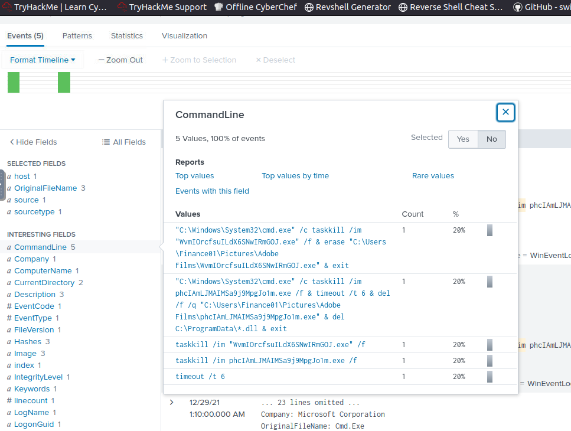

# New Hire Old Artifacts

This document describes the elaboration of the 'New Hire Old Artifacts' assignment

## Table of contents

-   [vraag 1](#vraag-1)
-   [vraag 2](#vraag-2)
-   [vraag 3](#vraag-3)
-   [vraag 4](#vraag-4)
-   [vraag 5](#vraag-5)
-   ...


## vraag 1
Voor vraag 1 hebben we dan in de zoekbalk gezocht op Web Browser Password Viewer en de tijd ingesteld op all time. In de logs zien we dan het pad staan naar het bestand 1111.exe. 

```
C:\Users\FINANC~1\AppData\Local\Temp\11111.exe
```

## vraag 2
Ook de bedrijfs naam vinden we terug in deze zelfde logs.

```
NirSoft
```

## vraag 3
Eerste hebben we gezocht op het pad van de 1111.exe met de pc naam in = Finance01.(C:\Users\Finance01\AppData\Local\Temp\). Hier hebben we de filter images ingesteld (via intresting fields) en zien we de meest voorkomende images in deze folder. Hierin zien we dat voor 82% van de logs IonicLarge.exe is gebruikt. We hebben dan gezocht op IonicLarge.exe. Dan hebben we bij meer fields original file name aangzet. zo hebben we de originele naam van dit bestand bekregen. = PalitExplorer.exe

```
PalitExplorer.exe, IonicLarge.exe
```


## vraag 4
Ook voor deze vraag hebben we gezocht op IonicLarge.exe. Bij intresting fields hebben we dan gezocht op filter destinationip. In de vraag staat dat er 2 connecties waren. bij 1 van de ip adressen zien we dan dat er 2 connecties zijn. Dit is dus het ip adress dat we zoeken.
```
2.56.59.42
```


## vraag 5
We hebben gezocht op IonicLarge.exe. In een log hebben we gevonden dat er een targetobject paramter is. Hierop hebben we dan gezocht en zo zijn we op het pad gekomen waar de key is aangepast.
```
HKLM\SOFTWARE\Policies\Microsoft\Windows Defender\
```

## vraag 6 
We hebben via de hint in try hack mee gezocht in splunk op de term "taskkill /im". In de log staat dan parent command line en hier zie je dat de kill wordt uitgevoerd. Dan hebben we in intresting fields gefilterd op commandline. Nu zien we de 2 Commando's staan van de programma's die ze hebben gekiled.
```
WvmIOrcfsuILdX6SNwIRmGOJ.exe,phcIAmLJMAIMSa9j9MpgJo1m.exe
```
