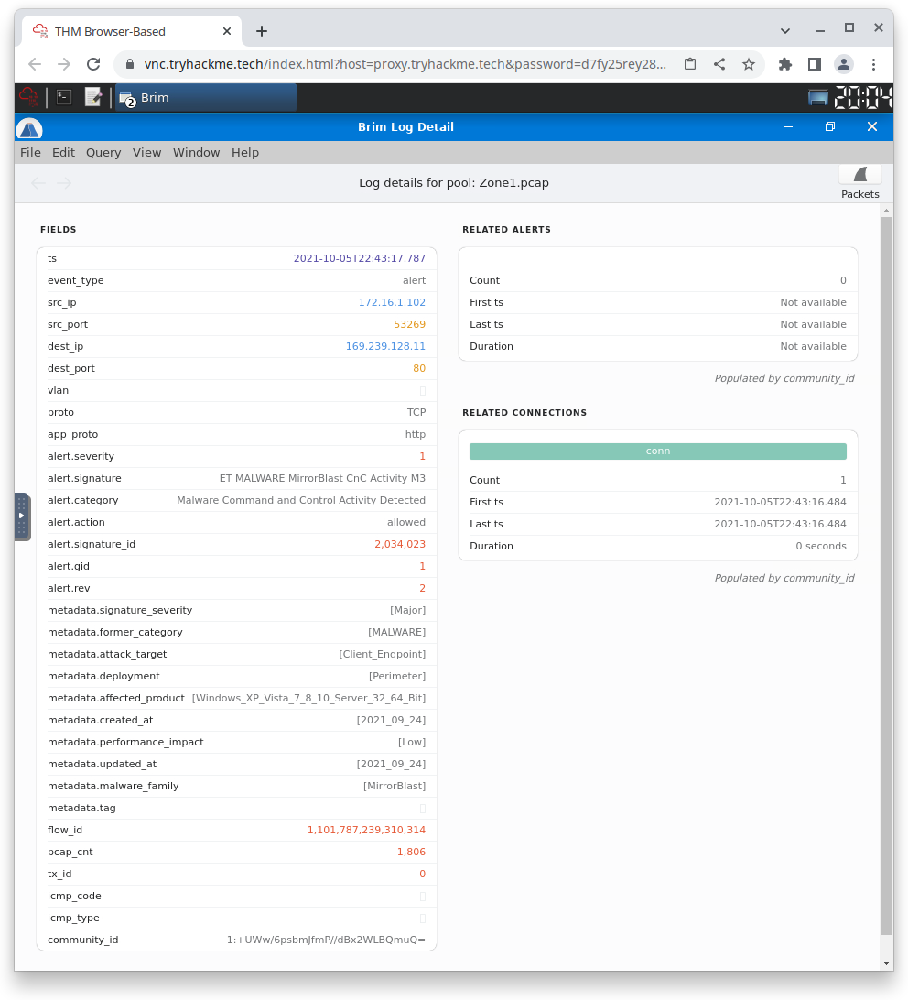
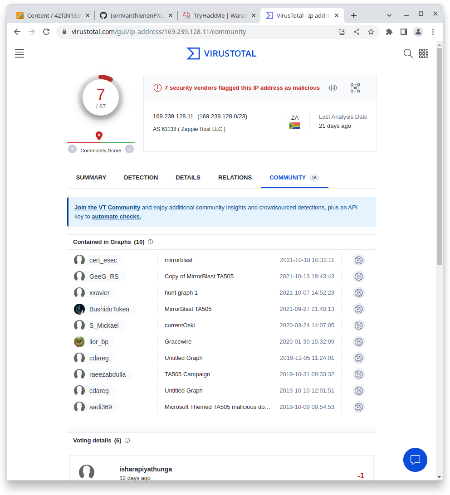
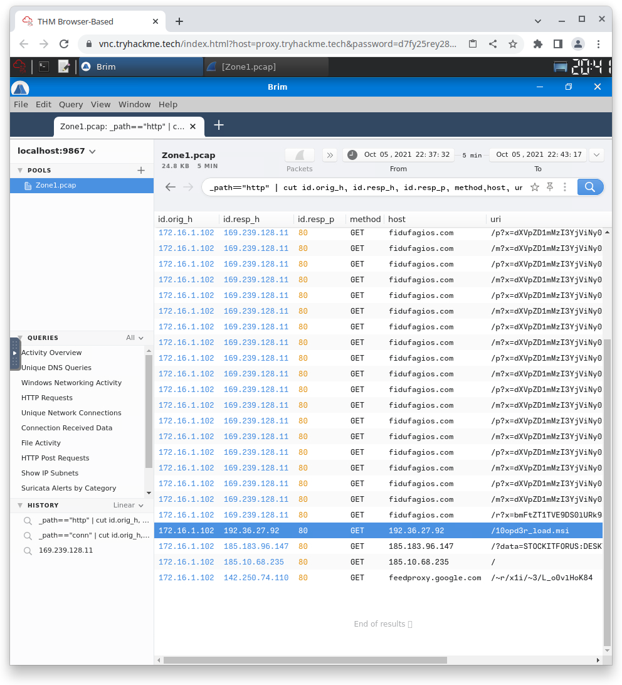
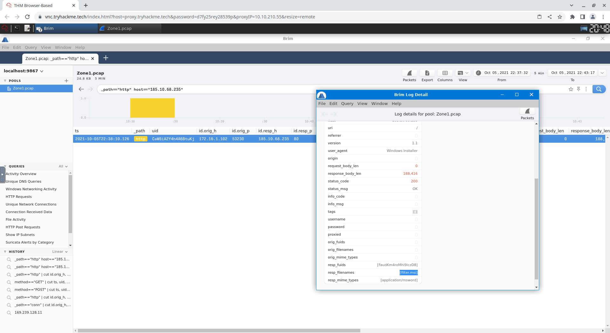
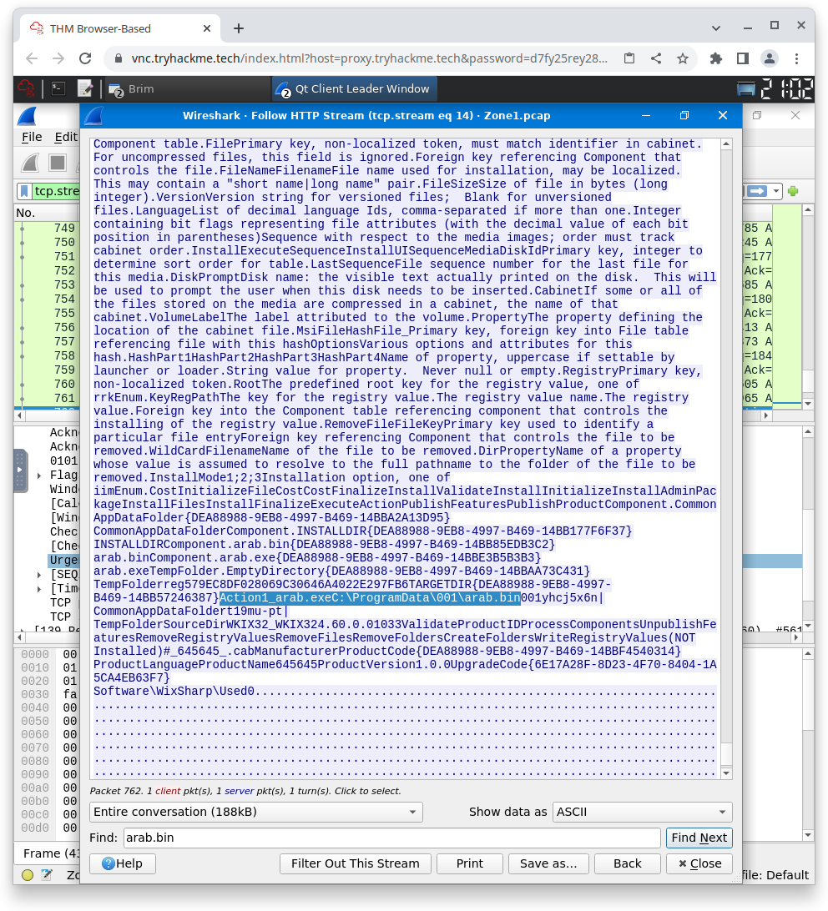
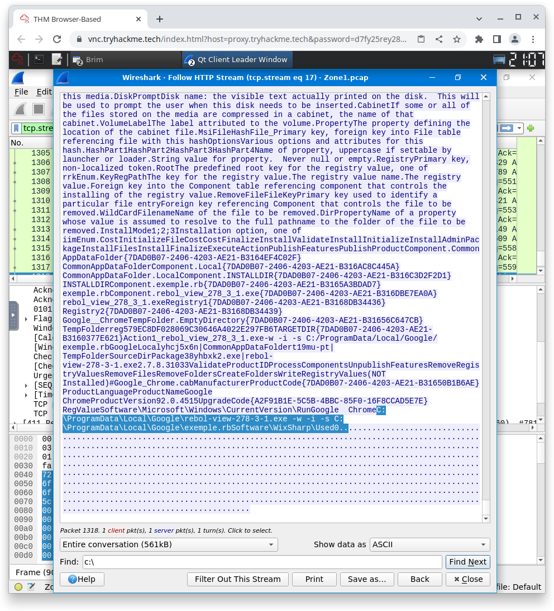

# Warzone 1

This document describes the elaboration of the 'Warzone 1' assignment

## Table of contents

-   [Begin onderzoek van PCAP file met de BRIM tool](#begin-onderzoek-van-pcap-file-met-de-brim-tool)

## Begin onderzoek van PCAP file met de BRIM tool

BRIM is een tool om netwerk traffic te visualizeren en te categorizeren.

We hebben de pcap file geimport in de BRIM tool en dan hebben we gezocht op het type 'alert'. Dan hebben we details van 1 van de alerts open gedaan en hebben we het signature gevonden

Signature: 'ET MALWARE MirrorBlast CnC Activity M3'

Dan gingen we opzoek naar het source IP address. Dit stond bij dezelfde log. Hetzelfde was waar voor het destination IP.

Source IP in defanged format: '172[.]16[.]1[.]102'

Destination IP in defanged format: '169[.]239[.]128[.]11'

Dan hebben we in de BRIM tool gefilterd op 'Unique DNS Queries' en toen stond 'fidufagios.com' vanboven met 3 hits. Deze hebben we in VirusTotal opgezocht en dit blijkt een domein te zijn wat malware bevat. Via VirusTotal hebben we het IP-address gevonden. Het serving IP address is '169.239.128.11' dit lijkt erg sterk op een APIPA address, maar dit is het niet want APIPA begint pas bij 169.254..

Serving IP Address in defanged format: 'fidufagios[.]com'

Om de threat group te vinden, klikte we verder op het ip en dan onder de tab 'Community' was 'TA505' te vinden. Onder dezelfde pagina vonden we ook de malware family.

Threat Group: 'TA505'

Malware family: 'MirrorBlast'

Om de file types te vinden gingen we terug naar de hoofdpagina van VirusTotal en deden we een search op 'fidufagios[.]com'. En dan onder de tab Relations vonden we het meest voorkomende type terug.

Majority file type: 'Windows Installer'

Om de user agent te vinden van het IP '169.239.128.11' hebben we in BRIM gefilterd op het IP en deden we een http entry open en hier stond de user_agent in.

User Agent: 'REBOL View 2.7.8.3.1'

Om de andere IP-adressen te vinden hebben we onder de query 'HTTP Requests' gekeken en hier viel op dat 1 IP naar '/10opd3r_load.msi' ging en het andere naar '/'.

Other IP-addresses associated with the attack: '192[.]36[.]27[.]92,185[.]10[.]68[.]235'

De gedownloade files waren te vinden onder de URL request die in het vorige ook te zien was. Om de 2de te vinden hebben we gefilterd op het andere IP en door op details te kijken van de entry staat onder file_name: 'filter.msi'.

files: '10opd3r_load.msi,filter.msi'

Om het pad te vinden van de files op de machine hebben we in Wireshark gefilterd op het IP en op HTTP en dan hebben we de http stream geopend en gezocht op 'C:/'. Er was wel een issue met het laatste pad, hier moest de S van '.rbS' geschreven worden om aanvaard te worden op tryHackMe.

File paths van eerste file: 'C:\ProgramData\001\arab.bin,C:\ProgramData\001\Action1_arab.exe'

File paths van tweede file: 'C:\ProgramData\Local\Google\rebol-view-278-3-1.exe,C:\ProgramData\Local\Google\exemple.rbS'