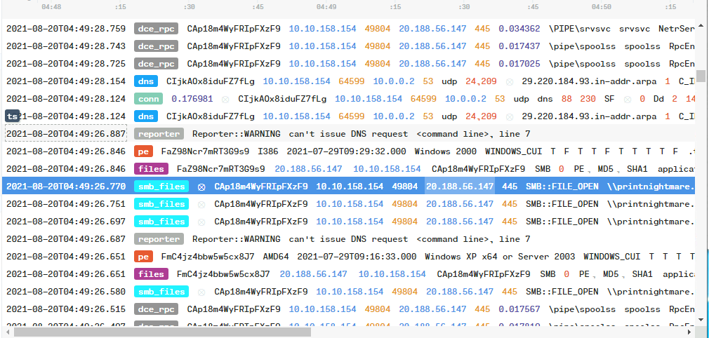
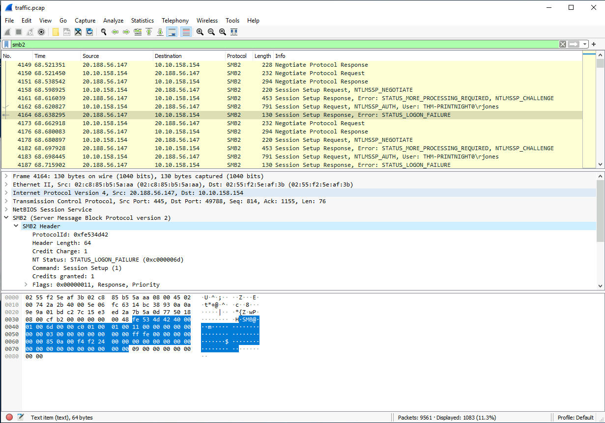
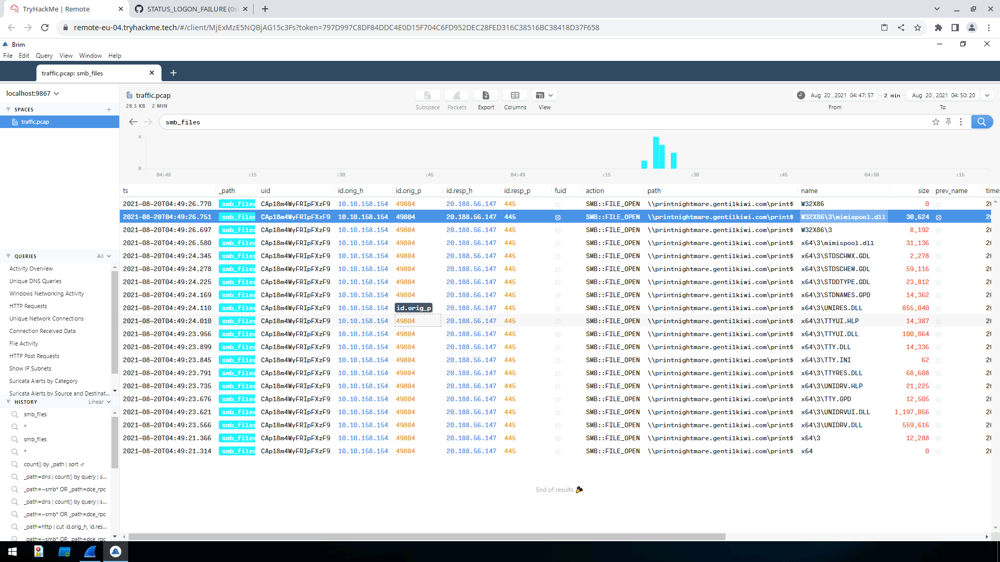
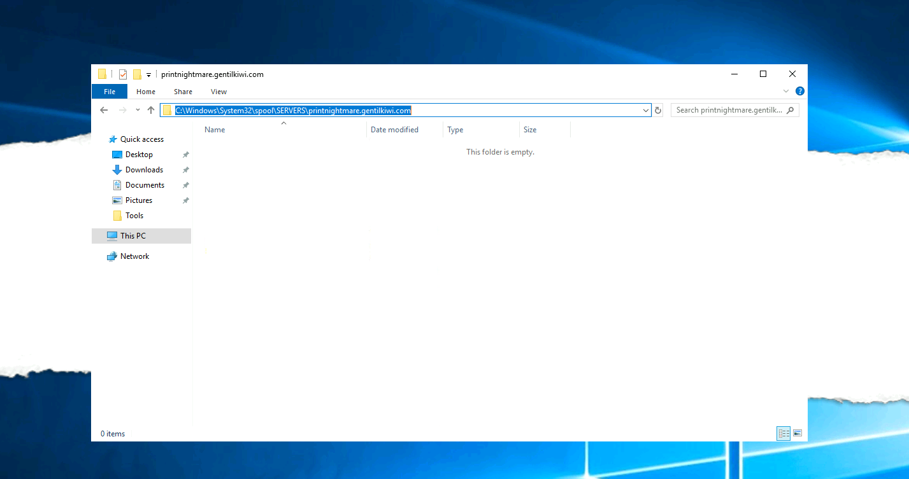
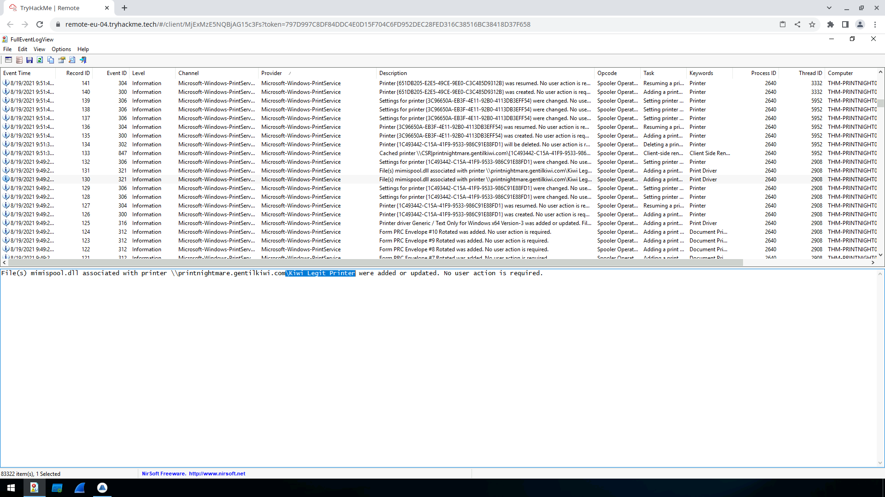

# PrintNightmare, thrice!

This document describes the elaboration of the 'PrintNightmare, thrice!' assignment

## Table of contents

-   [Vraag 1](#vraag-1)
-   [Vraag 2](#vraag-2)
-   [Vraag 3](#vraag-3)
-   [Vraag 4](#vraag-4)
-   [Vraag 5](#vraag-5)
-   [Vraag 6](#vraag-6)
-   [Vraag 7](#vraag-7)
-   [Vraag 8](#vraag-8)
-   [Vraag 9](#vraag-9)
-   [Vraag 10](#vraag-10)

## Vraag 1

We hebben de 'traffic.pcap' file geopend in de BRIM tool en gezocht naar SMB traffic en hier kwam hetvolgende IP uit.

Remote IP: '20.188.56.147'

## Vraag 2

Om de 'STATUS_LOGON_FAILURE' error te vinden. Hebben we deze status code opgezocht op Google en dit is een foutcode van SMB. Dus hebben we gefilterd in Wireshark op 'smb2'. Dan hebben we goed gekeken naar de entries en hier kwam al snel de entries met 'STATUS_LOGON_FAILURE' naar boven. Bij 1 van de entries met de error code is de username te vinden bij de voorgaande entry.

Username: 'THM-PRINTNIGHT0\rjones'

## Vraag 3

Door simpelweg even verder te scrollen tot de 'STATUS_LOGON_FAILURE' codes verdwijnen was er een login request te zien met een nieuwe user 'THM-PRINTNIGHT0/gentilguest'. Als je dan de voorgaande request bekijkt van deze login zie je onder SMB2 Header => NT Status: 'STATUS_SUCCESS'.

Username: 'THM-PRINTNIGHT0/gentilguest'

## Vraag 4

Door weer even aandachtig verder te scrollen is te zien dat hij een tree connect request doet naar '\\printnightmare.gentilkiwi.com\IPC$'. Dan even verder is te zien dat hij een create request doet voor 2 files: 'srvsvc' en 'spoolss'

Antwoord: '\\printnightmare.gentilkiwi.com\IPC$,srvsvc,spoolss'

## Vraag 5

Door in de BRIM tool te filteren op smb_files, is het vrij duidelijk te zien wat hij allemaal heeft zitten doen.

Antwoord: '\\printnightmare.gentilkiwi.com\print$,W32X86\3\mimispool.dll,x64\3\mimispool.dll'

## Vraag 6

We hebben zitten zoeken op dezelfde manier als de vorige vraag, alleen geraakte we er niet uit en hebben we de hint geraadpleegt. Deze hint zei dat we iets moesten doen met 'event logs'. We hebben de file 'Logfile' met de tool 'Process Monitor' geopend. Hierin hebben we gezocht naar 'mimispool.dll'. Hier hebben we goed gekeken naar de eerste met het Result 'Success'. We weten dat hij met 'X64 en W32X86' werkt, dus deze 2 directories moesten we zoeken.

Antwoord: 'C:\Windows\System32\spool\drivers\x64\3,C:\Windows\System32\spool\drivers\W32X86\3'

## Vraag 7

We zijn via 'Windows Explorer' naar het pad gegaan en hier hebben we rondgekeken in de spool folder. Hier stond onder de map 'SERVERS' de 'printnightmare.gentilkiwi.com'.

Antwoord: 'C:\Windows\System32\spool\SERVERS\printnightmare.gentilkiwi.com'

## Vraag 8

We zijn eerst gaan kijken naar de printers die deze Windows machine geregistreerd heeft staan, maar hier was niets te vinden. Dan hebben we verder in de logs proberen te zoeken. Na lang zoeken hebben we de hint gebruikt en deze zei 'Check Microsoft-Windows-PrintService'. Dan hebben we de logs aandachtig zitten bekijken die bij de printservice horen. Hierna zijn we naar de events gaan kijken. Hier hebben we alle events laten zien, gesorteerd op 'Microsoft-Windows-PrintService' en door ze 1 voor 1 af te gaan zijn we een event tegengekomen waarin de printernaam vermeld is.

Printer naam: 'Kiwi Legit Printer'

## Vraag 9

Hier gingen we terug kijken in de 'Process Monitor'. Helemaal onderaan de file kan je het process 'spoolsv.exe' terugvinden. Hierop hebben we dan gefiltered. Hier was direct het process ID van 'spoolsv.exe' te vinden. Eerst dachten we dat het '812' was, maar dit bleek niet te kloppen, na lang zoeken hebben we opgezocht wat het juiste antwoord zou zijn en dit was '5408'.

Antwoord: '5408,spoolsv.exe'

## Vraag 10

Na het vinden van het PPID van 'spoolsv.exe', hebben we gefilterd op '5408' en zijn we elk process afgegaan in de process monitor. Maar er was niets te vinden van een command. Na het gewoonweg niet te vinden, hebben we dit ook opgezocht en bleek dit hetvolgende antwoord te zijn. Dit antwoord vind je bij de events van de printer service.

Antwoord: 'net localgroup administrators rjones /add'