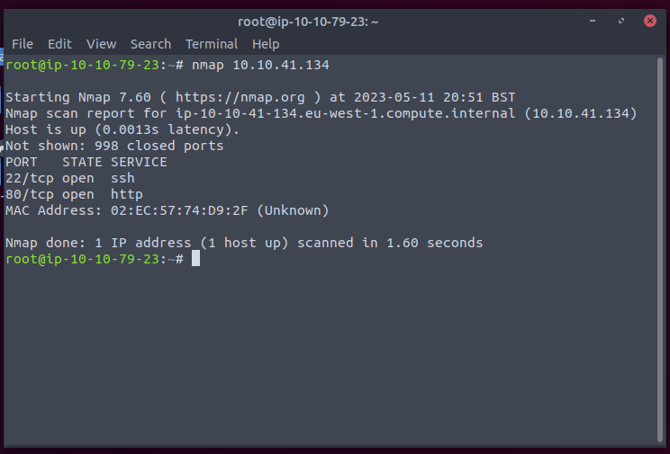
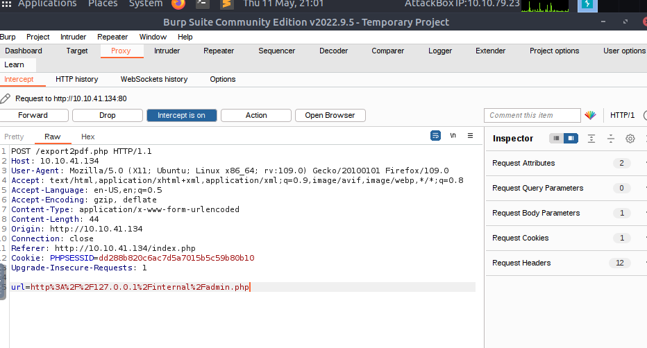
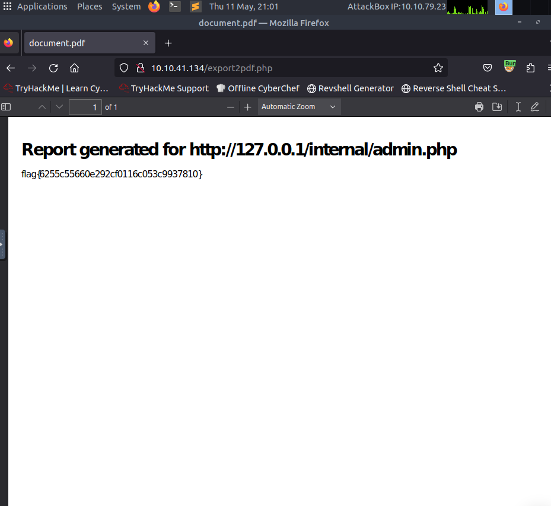

# Surfer

This document describes the elaboration of the 'Surfer' assignment

## Table of contents

-   [Surfer](#surfer)

## Surfer

Als eerste hadden we gepinged naar het gekregen IP om te kijken of het beschikbaar was en we kregen een reply.

Hierna hadden we een nmap scan uitgevoerd op het gekregen IP om te kijken welke poorten open stonden. Hierbij stond poort 22 en 80 open. Dit wil zeggen dat er waarschijnlijk een webserver en een SSH server draaiende is.

Alsvolgt hebben we gesurft naar het gekregen IP en kwamen we uit op een login pagina. Dan hebben we direct gesurft naar het IP zijn 'robots.txt' file en hierin stond het pad '/backup/chat.txt'. Dan hebben we naar dit pad gesurft en hierin zagen een chat log met Katie en de administrator. Hier werd in gemeld dat de admin moest stoppen met het gebruiken van zijn naam als wachtwoord. Er werd ook vermeld dat er een export2pdf server geinstalleerd was en deze voorlopig alleen een flag weergeeft. Dus dit kan een mogelijke exploit zijn.

Daarna hebben we gekeken of de admin wel degelijk zijn login veranderd had, maar dat was niet het geval. Dus hebben we zo kunnen inloggen op de webiste met de inlog gegevens 'admin' als gebruikersnaam en  'admin' als wachtwoord.

Na het bestuderen van de website zagen we verschillende dingen zoals de export to pdf optie en een link naar '/internal/admin.php'. Als we deze laatste link bezochten kregen we het bericht 'Eerste gepinged naar het gekrgen ip om te zien of deze beschikbaar was. '. Dus dit betekend dat we dit pad enkel vanaf lokale IP-adressen kunne raadplegen.

Als eerste hadden we gezocht naar exploits van PHP of de request te veranderen, maar dit bracht ons niks op. Toen gingen we de 'export2pdf' functie verder onderzoeken met de 'Burpsuite' tool en zo konden we de request onderscheppen naar de server. Deze request konden we aanpassen naar het pad '%2Finternal%2Fadmin.php' en daarna forwarden naar de server. Als gevolg kregen we de flag te zien.

Antwoord: 'flag{6255c55660e292cf0116c053c9937810}'
